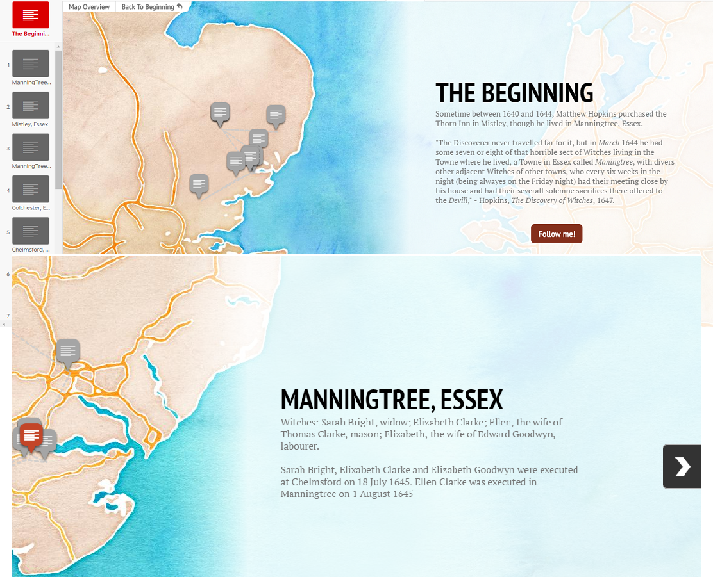
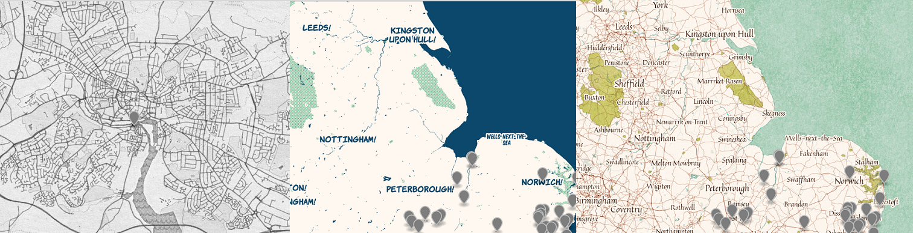

#Tutorial and Project Reflection
_March 12, 2016_

## There's a Map For That

Mapping data can be tedious, in fact I'll go right and out and say it is always tedious. 
Do the benefits of mapping data outweigh this tediousness... I can honestly say, after spending most my semester in HIST5702w working on a tutorial about creating a dataset and mapping that dataset, I'm still not sure.

This project, which I have been working on with [@emilykeyes], started out as a _two birds, one stone_ sort of thing. I needed to establish a timeline of the movements of Matthew Hopkins and John Stearne as part of my research for masters research project and I realized that being able to create a mapped visualization of this may reveal things that staring at a linear timeline or spreadsheet wouldn't. So why not make a tutorial about how to put together a dataset (from acquiring it to cleaning) and then use that dataset to construct a map using one of the many (dozens, literally, dozens) mapping applications available online.

When I first joined GitHub in December, I spent a fair amount of time searching around and seeing what kind of digital history projects were out there. One of the first ones I stumbled across was [@jones139](https://github.com/jones139)'s [HistoryMap](https://github.com/jones139/HistoryMap), which uses OpenStreetMap. Another mapping project that I discovered while touring through GitHub was [@danvk]'s [OldNYC Repo](https://github.com/danvk/oldnyc) which looks like this, [OldNYC](http://www.oldnyc.org), online. 

When I started thinking about what I wanted to use to make my map I looked a variety of different applications and programs, for example: StoryMap.js, MapBox, Palladio, CartoDB and World Map. 

However, it was after I saw this [demo](http://ewoken.github.io/Leaflet.MovingMarker/) that I decided that I wanted to use. 

_Deciding was the easy part._

I went to [leafletjs.com](http://leafletjs.com/index.html), turns out that if you want to build a map using leaflet, going to their website is not the best way to learn how to make one but the tutorials are not written for a person who is new to working or unfamiliar with Javascript. I spent several hours trying to understand the quick start guide, but I lost hope of ever understanding how to get leaflet to work.

_Of course this meant that I after I finished building a map with another program, I would suddenly learn how to use leaflet.js_

I stumbled across some examples of CartoDB torque maps, [here](http://cartodb.github.io/torque/examples/car.html) and [here](https://zzzkhakan.cartodb.com/viz/02c6db74-8cbe-11e5-bc90-0e5db1731f59/embed_map). These convinced me to use CartoDB, which I was a little familiar with from looking into map applications last year.

CartoDB is great for many reasons, #1, for me, is that it has a graphic interface which you can use to build your map on. However, this can be as tedious as building a map with javascript from scratch but without all the features and customization that using leaflet and javascript can provide.

Hours and hours of correcting the placement of markers, of tweaking lines, testing out different options, trying to merge layers can result in a map that is just, simply, pretty to look at. 

My entire project for HIST5702w is based on the premise that visualizing geographical data will provide another vantage from which to do analysis. It teaches you to scrap and clean a dataset and then to turn you data into map. But when I look at maps... I worry that they might just be pretty. I struggle to find something that I didn't already know.

[Infamous Witchfinders: Matthew Hopkins](https://lrowe.cartodb.com/viz/919a86b8-eae5-11e5-8c7b-0e3a376473ab/public_map)
[Infamous Witchfinders: John Stearne](https://lrowe.cartodb.com/viz/288b4fd8-ebd8-11e5-a983-0e3ff518bd15/public_map)
[Infamous Witchfinders: Accused Witches](https://lrowe.cartodb.com/viz/8c6e26b4-efa3-11e5-acac-0e3ff518bd15/public_map)

I'm left wondering if that perhaps the problem is the mapping tool that I chose. There are so many out there and alot of them seem very similar to one another, but some lean more towards research tool while others are more like presentation tools.

+StoryMap.js is an excellent mapping tool for presentations, more of a visual tool than one that could be used an aid for research and analysis.

+MapBox seemed to be a more complicated than GoogleMaps but simpler than CartoDB. The dashboard and graphical interface that it has built is not intuitive, nor user-friendly. Though I am a big fan of all their different map themes. 

