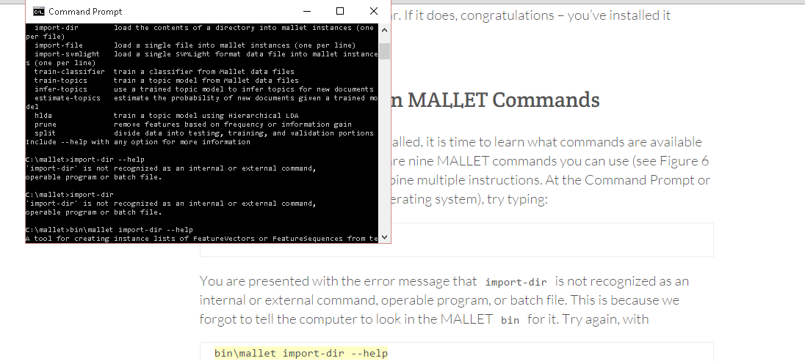
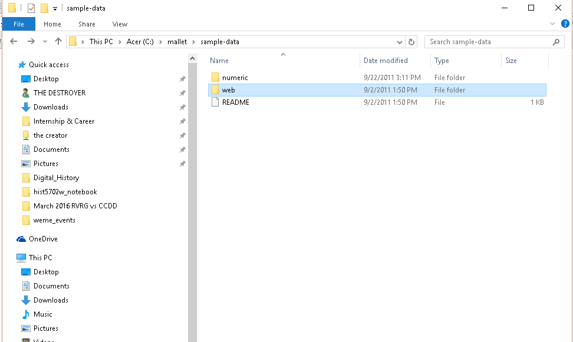
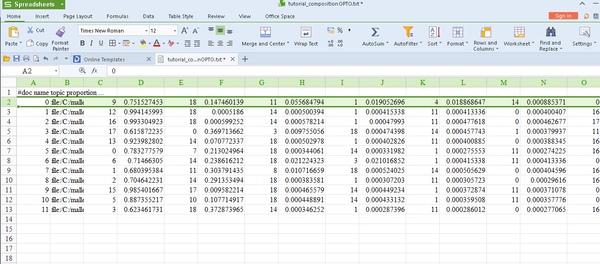

# Tutorial Reflection
__March 6, 2016__

## Malleus Digitus Historiarum
### (also known as Topic Modeling with MALLET)

The [Programming Historian's tutorial](http://programminghistorian.org/lessons/topic-modeling-and-mallet) on topic modeling using MALLET has done a wonderful job of making the tutorial accessible to either MAC or PC users in a very straightforward manner; provides screen shots for relevant to both MAC and PC users; does a wonderful job of explaining how topic modeling programs process unstructured text.

__March 7, 2016 Edit: Must not confuse this with determining word value based on the frequency of its use within a text or corpus. Topic modeling finds semantic patterns, topic modeling can tell the difference between words that are spelt the same but mean different things. It does this by comparing a word against all other words within a corpus. Unlike Overview and Voyant which look at word frequencies. Though tools like Overview and Voyant could be useful in determining the kinds of patterns and topics that might be worth investigating with topic modeling.__

Topic modeling can, in theory, be applied to a single text but typically it looks at a corpus of text (a collection of multiple different texts). It locates and identifies topic patterns in the corpus. Essentially lumping together words that correspond with pre-configured topics.

The screenshots combined with the written instructions made the installation of MALLET smooth like double churned ice cream. Real smooth. One bit I really enjoyed in this tutorial was when they incoporated a __learning through mistakes__ moment. They've incoporated a "mistake" in one of the steps that results in an error with what seems to be the specific intention of teaching through that mistake.

However, in the Importing Data section (for Windows users) I started to hit a wall. What was written wasn't matching what I was seeing. For example...

"In the sample data directory, there are a number of .txt files. Each one of these files is a single document, the text of a number of different web pages."

Personally it wasn't hard to discern that the tutorial was likely referring to one of the subfolders in this directory, but that may not necessarily be intuitive for everyone. However, I kept getting errors the first few times that I entered `bin\mallet import-dir --input C:\mallet\sample-data\web\en --output tutorial.mallet --keep-sequence --remove-stopwords` but then I realized that before entering this line of command I had to back out of the _sample-data_ directory.

After those little hiccups the tutorial is back to being straightforward and clear in the process and explanation of topic modeling with MALLET. The most valuable section of this whole tutorial is "Getting your own texts into MALLET" this may be one of only tutorials I've seen that include a section with the purpose of setting the user up to work with their own materials. 

Optomized line:
`bin\mallet train-topics  --input tutorial.mallet  --num-topics 20 --optimize-interval 25 --output-state topic-state.gz  --output-topic-keys tutorial_keysOPTO.txt --output-doc-topics tutorial_compositionOPTO.txt`

Looking at the compositionOPTO.txt in spreadsheet was interesting, though a little confusing. I made a small adjustment to the optomized interval number, just to see what happens, and I was surprised to see how much is varied in comparison to the screenshot in the tutorial. ([Figure 10](http://programminghistorian.org/images/fig-10-topic-composition.png))

MALLET is not the only method of Topic Modeling, it can be done with R and Python and Stanford Tools as well. __Though I was warned against it, I may attempt something with Stanford Tools. If only to write another tutorial about winning.__ In terms of functionality, I would like to try a method of topic modeling that has GUI. 

---

How do I feel about topic modeling?

I'd like to say a few things that might help to express how topic modeling makes me feel like Anxiety Cat. 

Frequently discussed in the field of history is the issue of historians approach their sources with pre-concieved ideas of what they will find. This (more often) unconcious lack of objectivity which historians have been criticized for effects how historians read and interpret the sources and archival materials which they use in their research. As grad students we have it hammered into us that we must be careful about seeing what we want to see in our sources. As grad students another thing we are familiar with is imposter syndrome. The magic of topic modeling is how it determines the relationship of a word within a text and within the corpus. 

The magic of topic modeling is how it determines the relationship of a word within a text and within the corpus.

~~Jacques Derrida would probably have [some beef with it.](https://www.youtube.com/watch?v=3Zw04hraCVo).~~

However, the very thing that makes it valuable is also its greatest weakness. Determining the value and meaning of a word with topic modeling requires a pre-concieved idea of which topics are most important. **See first paragraph** This is where my inexperience with data and pattern analysis begins to make me nervous when doing digital history. Topic modeling needs to be done over and over and over again in order to obtain a reliable or realistic sense of which topics are the most significant in a corpus/text. This, I think, is where there is ample oppurtunity for my research goals to interfere with the results of topic modeling, which then interfere with how I visualize the data and ultimately interpret it. The topic modeling program is pre-configured before it processes the text, this pre-configuration manipulates the text; each configuration can produce different results and therefore different conclusions.

It's an amazing tool for working with documents and text sources; it is able to identify all sort of interesting patterns and can allow you to interpret large quantities of text. It is a tool that, with my inexperience, makes me feel as though I could be missing something or seeing something that isn't really there. It would be nice to think that imposter syndrome has a major part in why I feel unconfident about the validity of my conclusions that are drawn from topic modeling. And it does... in part. [The Macroscope: Big Digital History](http://www.themacroscope.org/?page_id791) does a very good job, on page 42 to 43, of explaining why it is good to repeat the process over and over with tweaks here and there. ~~The authors of that also happen to be the same authors of the MALLET tutorial on Programming Historian.~~
